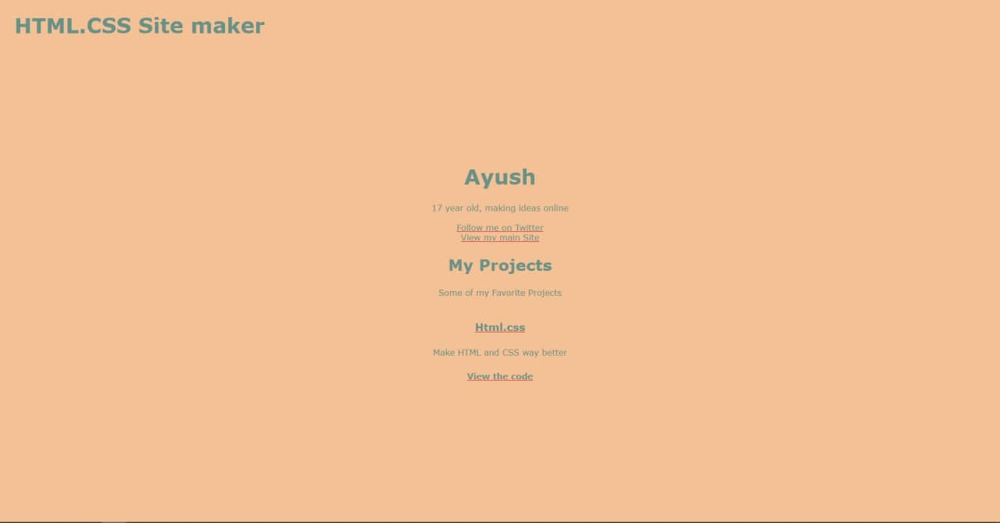

# HTML.css 
Make plain HTML pages beautiful with just one line of code 

<br>

## Getting Started

This requires no npm packages, just a simple cdn, with customizon options. It should take you 1 minute to get started with it.

### CDN
Just add the CDN to your head, and replace 'replacewithcolor' with a color you like, or want to try

```<link href="https://cdn.statically.io/gh/ayshptk/html.css/main/flavor/replacewithcolor.min.css" rel="stylesheet" >```

Here are the Colors, that work so far.

<br>

| Colors        | 
| ------------- |
| dark green   | 
| pink   |    
| white|   
| Red |
| Black |
| Purple |

You can easily switch the foreground and background colors with each other by adding invert/ just before the name of the css file, if you wish.
Just add invert-color, example invert-purple


# Examples

### Dark Green
Example of The Color Dark Green


Have an example? Please Share it, we'll share yours here


# Authors

 <a href="https//twitter.com/ayshptk"> Ayush </a> Who made this code </a>
 <br>
 <a href="https//twitter.com/heyarav/"> Arav </a> For Writing the Docs </a>
 <br>
 
 Check out <a href="https://writingprompts.ml"> Writing Prompts </a>, something I made with a Friend!
